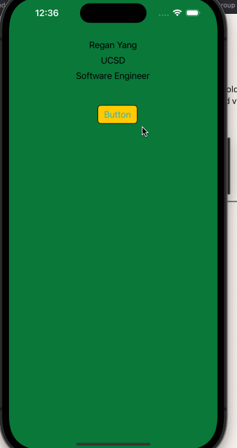

# Prework - *Background Changer*

Submitted by: **Regan Yang**

**Background Changer** is an app that changes the color of the background of the screen randomly.  

Time spent: **1** hours spent in total

## Required Features

The following **required** functionality is completed:

- [x] Users are see a screen with three labels and a button
- [x] Tapping the button changes the screen color to a random color
 
## Video Walkthrough

GIF created with [LiceCap](https://www.cockos.com/licecap/) for Mac

## App Brainstorming (Step 4)
- Discord
    - able to click on a message and reply to it specifically
    - servers on side bar(easy to access)
- Gmail
    - individual emails are separated cleanly (no lines)
    - sort emails by different attributes such as starred
- Spotify
    - button change color based on on/off
    - ease of navigation due to search bar and playlists on side

## Notes

Some challenges include finding commands and such in xCode. There's a lot of icons and it's hard to tell what each icon represents. 

## License

    Copyright 2023 Regan Yang

    Licensed under the Apache License, Version 2.0 (the "License");
    you may not use this file except in compliance with the License.
    You may obtain a copy of the License at

        http://www.apache.org/licenses/LICENSE-2.0

    Unless required by applicable law or agreed to in writing, software
    distributed under the License is distributed on an "AS IS" BASIS,
    WITHOUT WARRANTIES OR CONDITIONS OF ANY KIND, either express or implied.
    See the License for the specific language governing permissions and
    limitations under the License.
